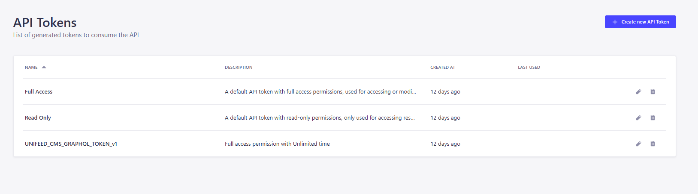

# CMS:

Manage collected information as a temporary admin page, with data synchronization with PostgreSQL

## Prerequisites
- PostgreSQL

## Run crawler

Step 1: Update node modules:

```bash
npm install
```
Step 2: Run Strapi CMS:

```bash
npm run develop
```
Step 3: Create and configure .env file like .env.sample file

Step 4: Get Token by CMS 
- Register, Login to CMS Admin at localhost:1337
- Go to Settings choose API Token then create new token like that:

- Set Token to UNIFEED_CMS_GRAPHQL_TOKEN in your crawler/.env file 

